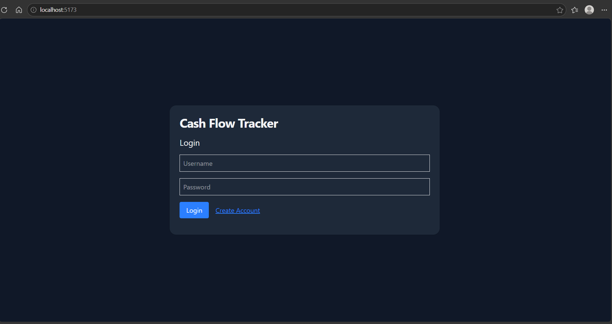
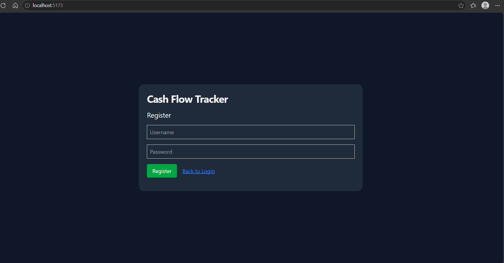
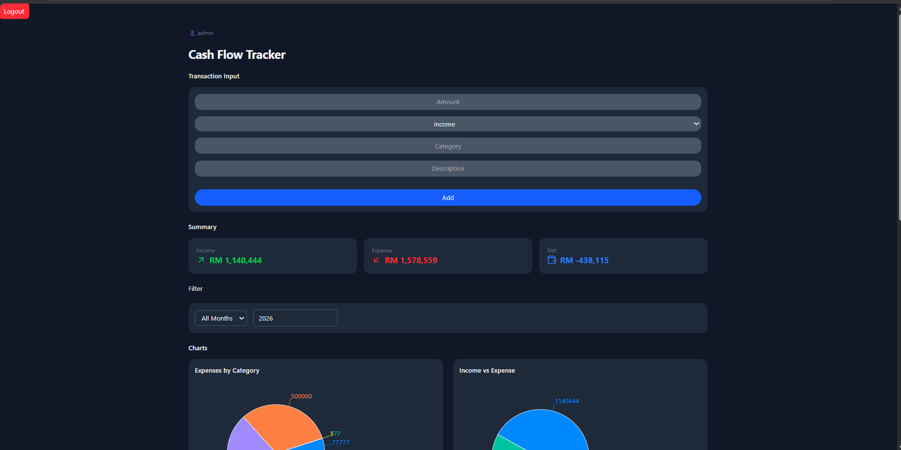
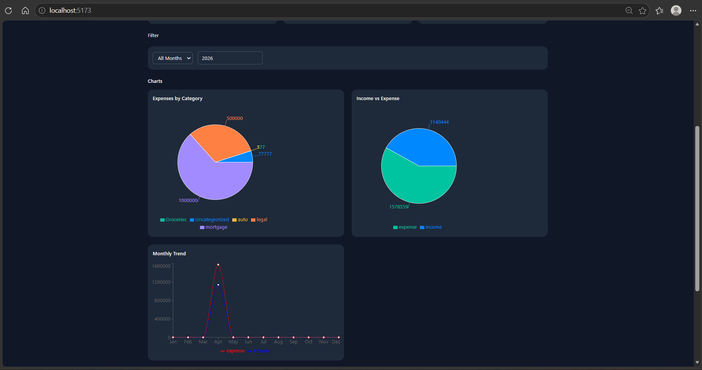
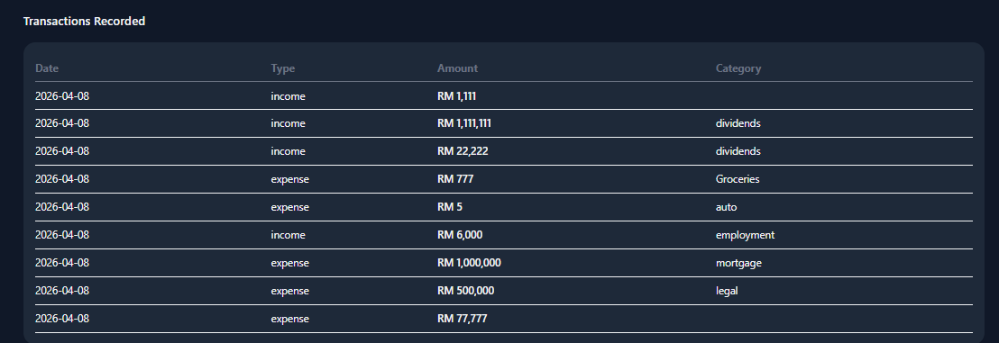

# Cash Flow Tracker Webapp

## Overview
A full-stack web application for tracking and visualizing personal cash flow.

Built with a FastAPI backend and React frontend, the system supports secure user authentication, transaction management, and real-time financial insights.

## Features
- User Authentication (JWT-based login and registration)
- Persistent data storage using SQLAlchemy (SQLite)
- Cash Flow tracking and Visualization
- RESTful API design with FastAPI
- Asynchronous data fetching with React Query
- AI-assisted entry integration (Ollama client)

## Tech Stack
### Backend
- Python (FastAPI)
- SQLALchemy (ORM)
- Pydantic (Data Validation)
- JWT Authentication (passlib)

### Frontend
- React (Vite)
- React-Query
- Axios
- Tailwind-CSS

## Architecture (simple)
Frontend (React) -> API Layer (FastAPI) -> Database (SQLAlchemy)

## How to Run

### Backend
cd backend
uvicorn main:app --reload

### Frontend
cd frontend
npm install
npm run dev

## Example Use Case

Users can input income and expenses, which are stored in the database and retrieved via API endpoints to generate visual insights into spending patterns.

## Results / Screenshots

## Future Improvements
- Deploy to cloud (e.g., Render / AWS)
- Add budgeting and forecasting features
- Enhance analytics with ML models
- Role-based access control

## Lessons Learned
- Designing RESTful APIs with FastAPI
- Managing frontend-backend integration
- Structuring scalable backend systems